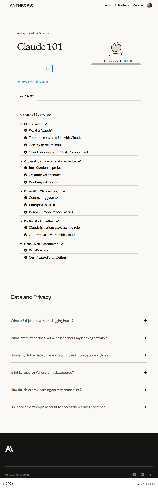
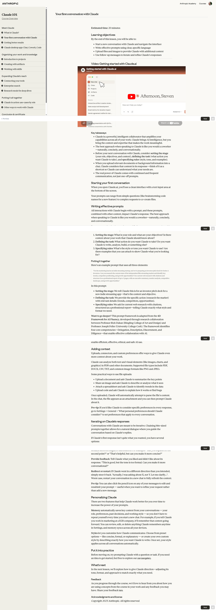
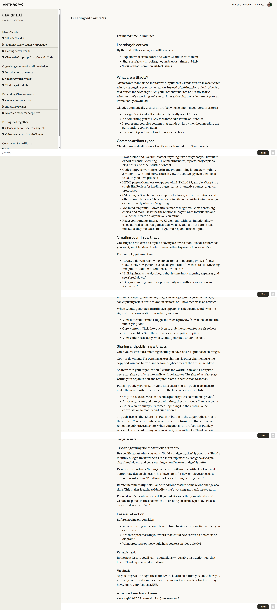
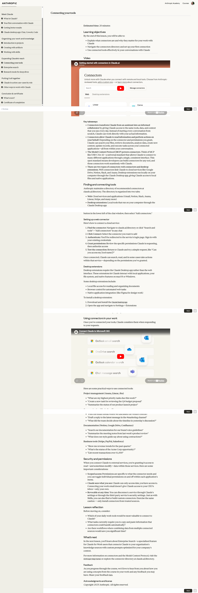
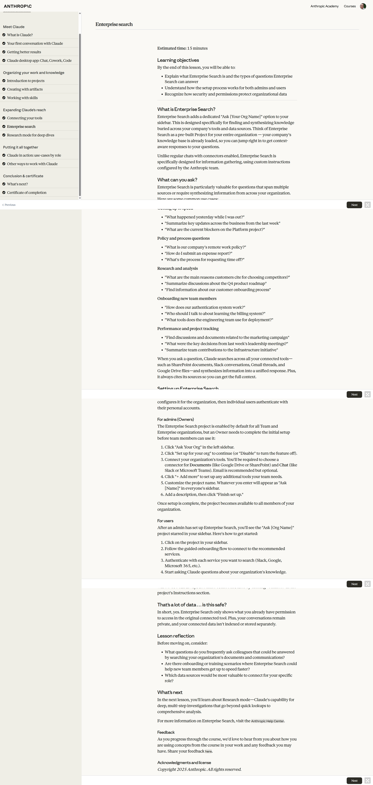
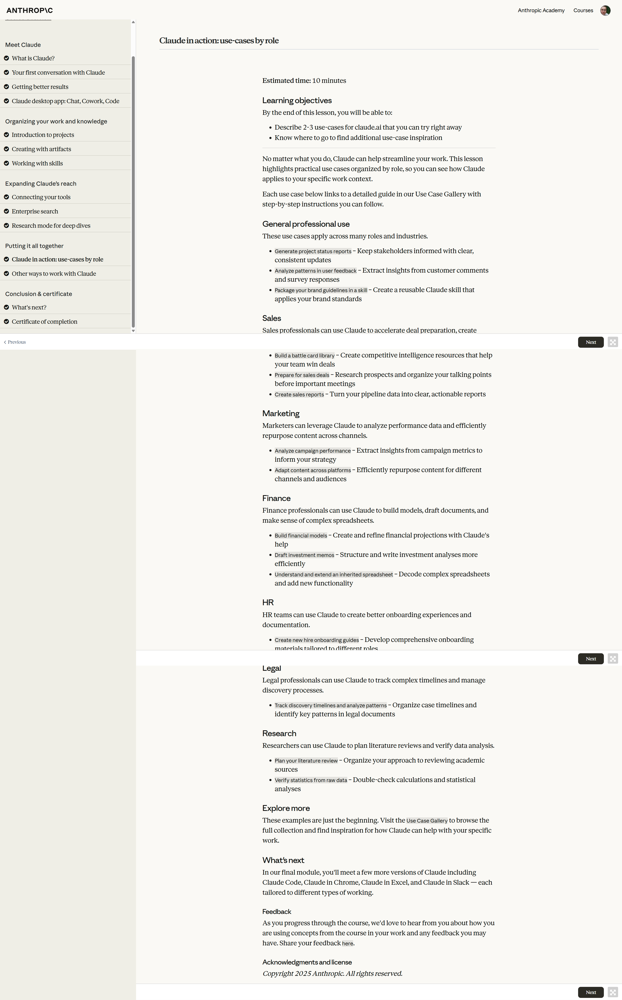
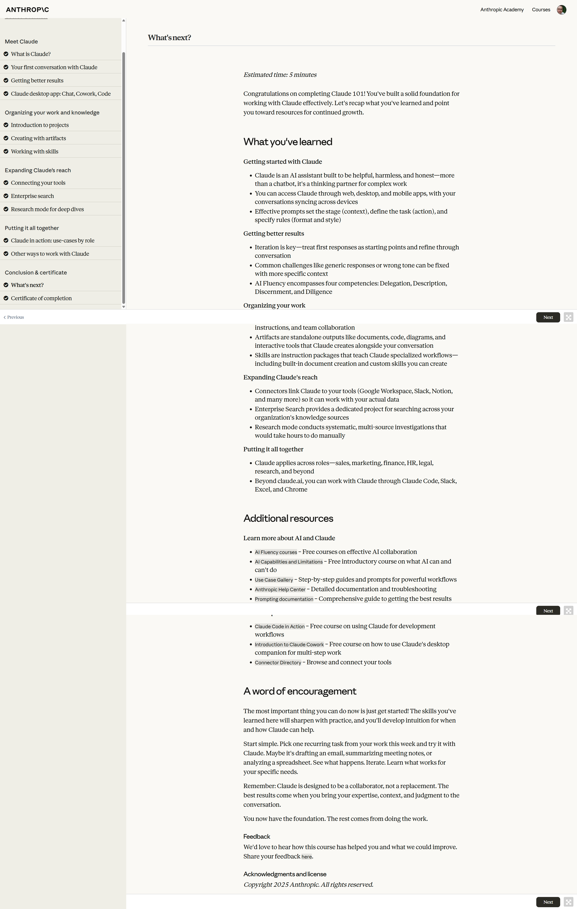
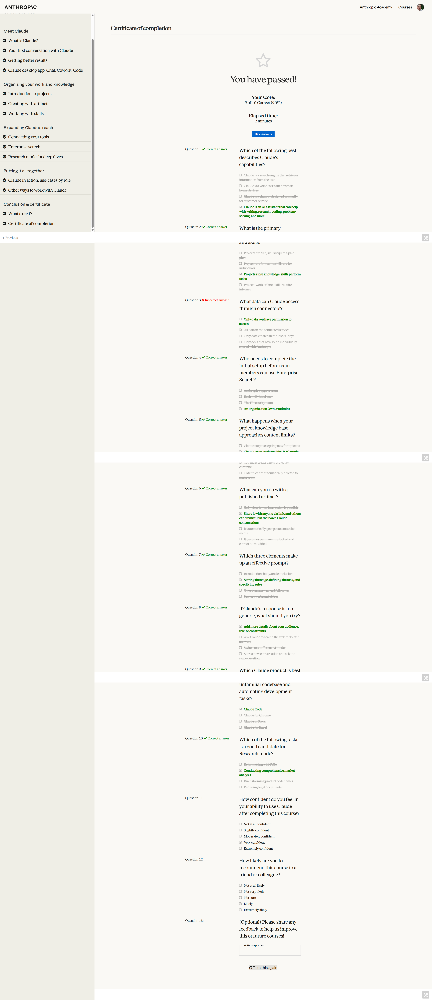

# Claude 101

## All courses (ranked)

1. [Claude 101](../1-claude-101/)
2. [Claude Code 101](../2-claude-code-101/)
3. [Introduction to Claude Cowork](../3-introduction-to-claude-cowork/)
4. [Claude Code in Action](../4-claude-code-in-action/)
5. [AI Fluency: Framework & Foundations](../5-ai-fluency-framework-foundations/)
6. [Building with the Claude API](../6-building-with-the-claude-api/)
7. [Introduction to Model Context Protocol](../7-introduction-to-model-context-protocol/)
8. [AI Fluency for educators](../8-ai-fluency-for-educators/)
9. [AI Fluency for students](../9-ai-fluency-for-students/)
10. [Model Context Protocol: Advanced Topics](../10-model-context-protocol-advanced-topics/)
11. [Claude with Amazon Bedrock](../11-claude-with-amazon-bedrock/)
12. [Claude with Google Cloud's Vertex AI](../12-claude-with-google-clouds-vertex-ai/)
13. [Teaching AI Fluency](../13-teaching-ai-fluency/)
14. [AI Fluency for nonprofits](../14-ai-fluency-for-nonprofits/)
15. [Introduction to agent skills](../15-introduction-to-agent-skills/)
16. [Introduction to subagents](../16-introduction-to-subagents/)
17. [AI Capabilities and Limitations](../17-ai-capabilities-and-limitations/)

## Course overview topics

1. What is Claude?
2. Your first conversation with Claude
3. Getting better results
4. Claude desktop app: Chat, Cowork, Code
5. Introduction to projects
6. Creating with artifacts
7. Working with skills
8. Connecting your tools
9. Enterprise search
10. Research mode for deep dives
11. Claude in action: use-cases by role
12. Other ways to work with Claude
13. What's next?
14. Certificate of completion

## Course overview

## 1. What is Claude?

## 2. Your first conversation with Claude

## 3. Getting better results

## 4. Claude desktop app: Chat, Cowork, Code

## 5. Introduction to projects

## 6. Creating with artifacts

## 7. Working with skills

## 8. Connecting your tools

## 9. Enterprise search

## 10. Research mode for deep dives

## 11. Claude in action: use-cases by role

## 12. Other ways to work with Claude

## 13. What's next?

## 14. Certificate of completion

