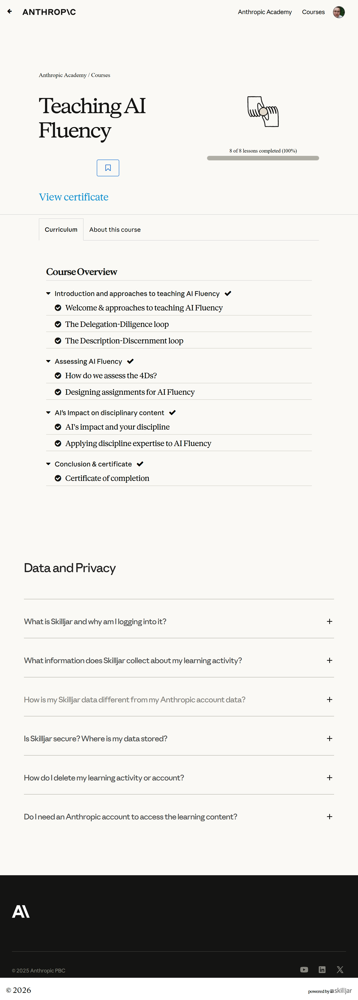

# Teaching AI Fluency

## All courses (ranked)

1. [Claude 101](../1-claude-101/)
2. [Claude Code 101](../2-claude-code-101/)
3. [Introduction to Claude Cowork](../3-introduction-to-claude-code/)
4. [Claude Code in Action](../4-claude-code-in-action/)
5. [AI Fluency: Framework & Foundations](../5-ai-fluency-framework-foundations/)
6. [Building with the Claude API](../6-building-with-the-claude-api/)
7. [Introduction to Model Context Protocol](../7-introduction-to-model-context-protocol/)
8. [AI Fluency for educators](../8-ai-fluency-for-educators/)
9. [AI Fluency for students](../9-ai-fluency-for-students/)
10. [Model Context Protocol: Advanced Topics](../10-model-context-protocol-advanced-topics/)
11. [Claude with Amazon Bedrock](../11-claude-with-amazon-bedrock/)
12. [Claude with Google Cloud's Vertex AI](../12-claude-with-google-clouds-vertex-ai/)
13. [Teaching AI Fluency](../13-teaching-ai-fluency/)
14. [AI Fluency for nonprofits](../14-ai-fluency-for-nonprofits/)
15. [Introduction to agent skills](../15-introduction-to-agent-skills/)
16. [Introduction to subagents](../16-introduction-to-subagents/)
17. [AI Capabilities and Limitations](../17-ai-capabilities-and-limitations/)

## Course overview topics

1. Welcome & approaches to teaching AI Fluency
2. The Delegation-Diligence loop
3. The Description-Discernment loop
4. How do we assess the 4Ds?
5. Designing assignments for AI Fluency
6. AI's impact and your discipline
7. Applying discipline expertise to AI Fluency
8. Certificate of completion

## Course overview

## 1. Welcome & approaches to teaching AI Fluency

Add screenshots for this topic.

## 2. The Delegation-Diligence loop

Add screenshots for this topic.

## 3. The Description-Discernment loop

Add screenshots for this topic.

## 4. How do we assess the 4Ds?

Add screenshots for this topic.

## 5. Designing assignments for AI Fluency

Add screenshots for this topic.

## 6. AI's impact and your discipline

Add screenshots for this topic.

## 7. Applying discipline expertise to AI Fluency

Add screenshots for this topic.

## 8. Certificate of completion

Add screenshots for this topic.
