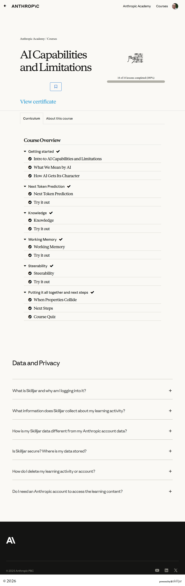

# AI Capabilities and Limitations

## All courses (ranked)

1. [Claude 101](../1-claude-101/)
2. [Claude Code 101](../2-claude-code-101/)
3. [Introduction to Claude Cowork](../3-introduction-to-claude-cowork/)
4. [Claude Code in Action](../4-claude-code-in-action/)
5. [AI Fluency: Framework & Foundations](../5-ai-fluency-framework-foundations/)
6. [Building with the Claude API](../6-building-with-the-claude-api/)
7. [Introduction to Model Context Protocol](../7-introduction-to-model-context-protocol/)
8. [AI Fluency for educators](../8-ai-fluency-for-educators/)
9. [AI Fluency for students](../9-ai-fluency-for-students/)
10. [Model Context Protocol: Advanced Topics](../10-model-context-protocol-advanced-topics/)
11. [Claude with Amazon Bedrock](../11-claude-with-amazon-bedrock/)
12. [Claude with Google Cloud's Vertex AI](../12-claude-with-google-clouds-vertex-ai/)
13. [Teaching AI Fluency](../13-teaching-ai-fluency/)
14. [AI Fluency for nonprofits](../14-ai-fluency-for-nonprofits/)
15. [Introduction to agent skills](../15-introduction-to-agent-skills/)
16. [Introduction to subagents](../16-introduction-to-subagents/)
17. [AI Capabilities and Limitations](../17-ai-capabilities-and-limitations/)

## Course overview topics

1. Intro to AI Capabilities and Limitations
2. What We Mean by AI
3. How AI Gets Its Character
4. Next Token Prediction
5. Try it out (Next Token Prediction)
6. Knowledge
7. Try it out (Knowledge)
8. Working Memory
9. Try it out (Working Memory)
10. Steerability
11. Try it out (Steerability)
12. When Properties Collide
13. Next Steps
14. Course Quiz

## Course overview

## 1. Intro to AI Capabilities and Limitations

Add screenshots for this topic.

## 2. What We Mean by AI

Add screenshots for this topic.

## 3. How AI Gets Its Character

Add screenshots for this topic.

## 4. Next Token Prediction

Add screenshots for this topic.

## 5. Try it out (Next Token Prediction)

Add screenshots for this topic.

## 6. Knowledge

Add screenshots for this topic.

## 7. Try it out (Knowledge)

Add screenshots for this topic.

## 8. Working Memory

Add screenshots for this topic.

## 9. Try it out (Working Memory)

Add screenshots for this topic.

## 10. Steerability

Add screenshots for this topic.

## 11. Try it out (Steerability)

Add screenshots for this topic.

## 12. When Properties Collide

Add screenshots for this topic.

## 13. Next Steps

Add screenshots for this topic.

## 14. Course Quiz

Add screenshots for this topic.
