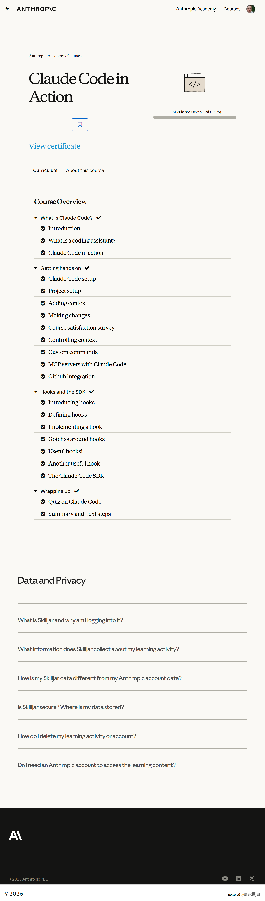

# Claude Code in Action

## All courses (ranked)

1. [Claude 101](../1-claude-101/)
2. [Claude Code 101](../2-claude-code-101/)
3. [Introduction to Claude Cowork](../3-introduction-to-claude-code/)
4. [Claude Code in Action](../4-claude-code-in-action/)
5. [AI Fluency: Framework & Foundations](../5-ai-fluency-framework-foundations/)
6. [Building with the Claude API](../6-building-with-the-claude-api/)
7. [Introduction to Model Context Protocol](../7-introduction-to-model-context-protocol/)
8. [AI Fluency for educators](../8-ai-fluency-for-educators/)
9. [AI Fluency for students](../9-ai-fluency-for-students/)
10. [Model Context Protocol: Advanced Topics](../10-model-context-protocol-advanced-topics/)
11. [Claude with Amazon Bedrock](../11-claude-with-amazon-bedrock/)
12. [Claude with Google Cloud's Vertex AI](../12-claude-with-google-clouds-vertex-ai/)
13. [Teaching AI Fluency](../13-teaching-ai-fluency/)
14. [AI Fluency for nonprofits](../14-ai-fluency-for-nonprofits/)
15. [Introduction to agent skills](../15-introduction-to-agent-skills/)
16. [Introduction to subagents](../16-introduction-to-subagents/)
17. [AI Capabilities and Limitations](../17-ai-capabilities-and-limitations/)

## Course overview topics

1. Introduction
2. What is a coding assistant?
3. Claude Code in action
4. Claude Code setup
5. Project setup
6. Adding context
7. Making changes
8. Course satisfaction survey
9. Controlling context
10. Custom commands
11. MCP servers with Claude Code
12. Github integration
13. Introducing hooks
14. Defining hooks
15. Implementing a hook
16. Gotchas around hooks
17. Useful hooks!
18. Another useful hook
19. The Claude Code SDK
20. Quiz on Claude Code
21. Summary and next steps

## Course overview

## 1. Introduction

Add screenshots for this topic.

## 2. What is a coding assistant?

Add screenshots for this topic.

## 3. Claude Code in action

Add screenshots for this topic.

## 4. Claude Code setup

Add screenshots for this topic.

## 5. Project setup

Add screenshots for this topic.

## 6. Adding context

Add screenshots for this topic.

## 7. Making changes

Add screenshots for this topic.

## 8. Course satisfaction survey

Add screenshots for this topic.

## 9. Controlling context

Add screenshots for this topic.

## 10. Custom commands

Add screenshots for this topic.

## 11. MCP servers with Claude Code

Add screenshots for this topic.

## 12. Github integration

Add screenshots for this topic.

## 13. Introducing hooks

Add screenshots for this topic.

## 14. Defining hooks

Add screenshots for this topic.

## 15. Implementing a hook

Add screenshots for this topic.

## 16. Gotchas around hooks

Add screenshots for this topic.

## 17. Useful hooks!

Add screenshots for this topic.

## 18. Another useful hook

Add screenshots for this topic.

## 19. The Claude Code SDK

Add screenshots for this topic.

## 20. Quiz on Claude Code

Add screenshots for this topic.

## 21. Summary and next steps

Add screenshots for this topic.
