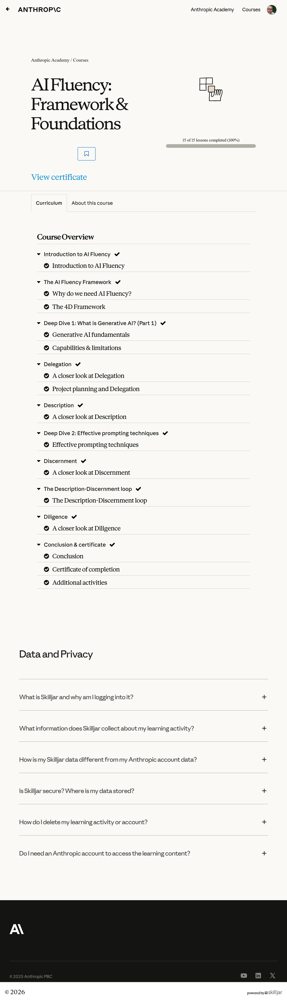

# AI Fluency: Framework & Foundations

## All courses (ranked)

1. [Claude 101](../1-claude-101/)
2. [Claude Code 101](../2-claude-code-101/)
3. [Introduction to Claude Cowork](../3-introduction-to-claude-code/)
4. [Claude Code in Action](../4-claude-code-in-action/)
5. [AI Fluency: Framework & Foundations](../5-ai-fluency-framework-foundations/)
6. [Building with the Claude API](../6-building-with-the-claude-api/)
7. [Introduction to Model Context Protocol](../7-introduction-to-model-context-protocol/)
8. [AI Fluency for educators](../8-ai-fluency-for-educators/)
9. [AI Fluency for students](../9-ai-fluency-for-students/)
10. [Model Context Protocol: Advanced Topics](../10-model-context-protocol-advanced-topics/)
11. [Claude with Amazon Bedrock](../11-claude-with-amazon-bedrock/)
12. [Claude with Google Cloud's Vertex AI](../12-claude-with-google-clouds-vertex-ai/)
13. [Teaching AI Fluency](../13-teaching-ai-fluency/)
14. [AI Fluency for nonprofits](../14-ai-fluency-for-nonprofits/)
15. [Introduction to agent skills](../15-introduction-to-agent-skills/)
16. [Introduction to subagents](../16-introduction-to-subagents/)
17. [AI Capabilities and Limitations](../17-ai-capabilities-and-limitations/)

## Course overview topics

1. Introduction to AI Fluency
2. Why do we need AI Fluency?
3. The 4D Framework
4. Generative AI fundamentals
5. Capabilities & limitations
6. A closer look at Delegation
7. Project planning and Delegation
8. A closer look at Description
9. Effective prompting techniques
10. A closer look at Discernment
11. The Description-Discernment loop
12. A closer look at Diligence
13. Conclusion
14. Certificate of completion
15. Additional activities

## Course overview

## 1. Introduction to AI Fluency

Add screenshots for this topic.

## 2. Why do we need AI Fluency?

Add screenshots for this topic.

## 3. The 4D Framework

Add screenshots for this topic.

## 4. Generative AI fundamentals

Add screenshots for this topic.

## 5. Capabilities & limitations

Add screenshots for this topic.

## 6. A closer look at Delegation

Add screenshots for this topic.

## 7. Project planning and Delegation

Add screenshots for this topic.

## 8. A closer look at Description

Add screenshots for this topic.

## 9. Effective prompting techniques

Add screenshots for this topic.

## 10. A closer look at Discernment

Add screenshots for this topic.

## 11. The Description-Discernment loop

Add screenshots for this topic.

## 12. A closer look at Diligence

Add screenshots for this topic.

## 13. Conclusion

Add screenshots for this topic.

## 14. Certificate of completion

Add screenshots for this topic.

## 15. Additional activities

Add screenshots for this topic.
