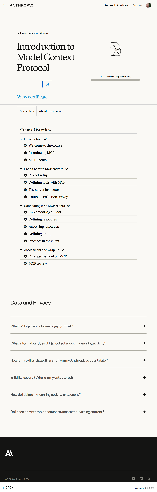

# Introduction to Model Context Protocol

## All courses (ranked)

1. [Claude 101](../1-claude-101/)
2. [Claude Code 101](../2-claude-code-101/)
3. [Introduction to Claude Cowork](../3-introduction-to-claude-code/)
4. [Claude Code in Action](../4-claude-code-in-action/)
5. [AI Fluency: Framework & Foundations](../5-ai-fluency-framework-foundations/)
6. [Building with the Claude API](../6-building-with-the-claude-api/)
7. [Introduction to Model Context Protocol](../7-introduction-to-model-context-protocol/)
8. [AI Fluency for educators](../8-ai-fluency-for-educators/)
9. [AI Fluency for students](../9-ai-fluency-for-students/)
10. [Model Context Protocol: Advanced Topics](../10-model-context-protocol-advanced-topics/)
11. [Claude with Amazon Bedrock](../11-claude-with-amazon-bedrock/)
12. [Claude with Google Cloud's Vertex AI](../12-claude-with-google-clouds-vertex-ai/)
13. [Teaching AI Fluency](../13-teaching-ai-fluency/)
14. [AI Fluency for nonprofits](../14-ai-fluency-for-nonprofits/)
15. [Introduction to agent skills](../15-introduction-to-agent-skills/)
16. [Introduction to subagents](../16-introduction-to-subagents/)
17. [AI Capabilities and Limitations](../17-ai-capabilities-and-limitations/)

## Course overview topics

1. Welcome to the course
2. Introducing MCP
3. MCP clients
4. Project setup
5. Defining tools with MCP
6. The server inspector
7. Course satisfaction survey
8. Implementing a client
9. Defining resources
10. Accessing resources
11. Defining prompts
12. Prompts in the client
13. Final assessment on MCP
14. MCP review

## Course overview

## 1. Welcome to the course

Add screenshots for this topic.

## 2. Introducing MCP

Add screenshots for this topic.

## 3. MCP clients

Add screenshots for this topic.

## 4. Project setup

Add screenshots for this topic.

## 5. Defining tools with MCP

Add screenshots for this topic.

## 6. The server inspector

Add screenshots for this topic.

## 7. Course satisfaction survey

Add screenshots for this topic.

## 8. Implementing a client

Add screenshots for this topic.

## 9. Defining resources

Add screenshots for this topic.

## 10. Accessing resources

Add screenshots for this topic.

## 11. Defining prompts

Add screenshots for this topic.

## 12. Prompts in the client

Add screenshots for this topic.

## 13. Final assessment on MCP

Add screenshots for this topic.

## 14. MCP review

Add screenshots for this topic.
